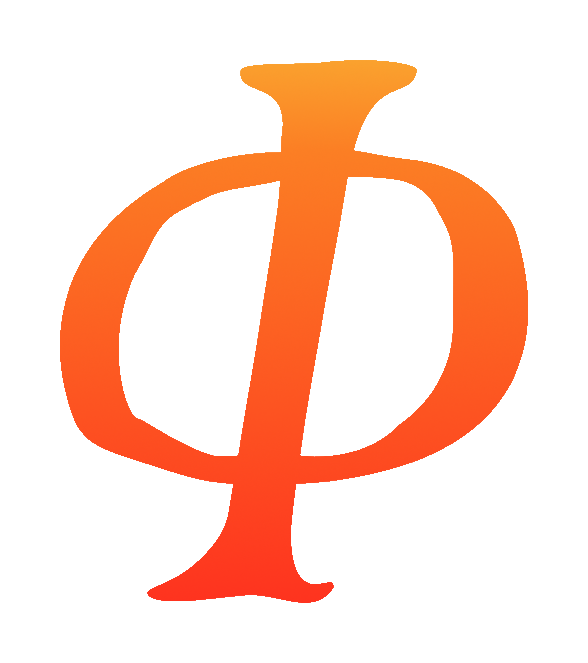

  
  <h3 align="center">Real quantum mechanics for your Unity games.</h3>

 

# Welcome to the Quantum Forge Unity API
For developers pushing the boundaries of gameplay design, Quantum Forge provides a foundation for creating quantum-native games.

Built from years of experimentation, including lessons learned while creating [Quantum Chess](https://store.steampowered.com/app/453870/Quantum_Chess/), the toolkit makes it straightforward to integrate real quantum physics into game design. Superposition, entanglement, interference, and measurement collapse become tools in your design toolbox.

Join the community on [Discord](https://discord.gg/9rjj4eWEsB)!

## [Getting Started](articles/getting-started.md)
Learn how to integrate Quantum Forge into your Unity project.

## [Advanced Topics](articles/advanced-topics.md)
Dive deeper into advanced features and use cases.

## [API Reference](api/index.md)
Explore the complete API documentation for the Quantum Forge Unity package.

## [License](articles/proprietary-notice.md)
View license information for the Quantum Forge Unity package.
